<p align="center">
  
</p>


<h1 align="center">Note App</h1>

<p align="center">
  A native Android notes and todo companion app, built with Kotlin and Jetpack Compose, backed by a Node.js/MongoDB REST API — with a built-in AI assistant that can manage your notes and tasks for you.
</p>

<p align="center">
  
  
  
  
  
  
  
  
</p>

<p align="center">
  
  
  
  
  
  
  
  
</p>

## Overview

Note App is a native Android client for creating, organizing, and syncing notes and todos. It follows a layered `core / data / domain / ui` architecture with a repository pattern, offline-first local storage via Room, and a remote REST API layer that talks to the [note-app-backend](https://github.com/MegrurNiftiyev/note-app-backend) service (Node.js, Express, MongoDB).

On top of that, the app ships an **in-app AI assistant** that can read your existing notes and todos and directly create, update, or delete them for you through natural conversation — see [AI Assistant](#ai-assistant) below.

Authentication uses short-lived JWT access tokens with automatic refresh, and sensitive tokens are kept in encrypted local storage rather than plain SharedPreferences.

## Core Features

- Notes and todos with local-first storage and remote sync
- **AI chat assistant** that understands your notes/todos and can create, update, delete, or summarize them on request
- JWT authentication with automatic token refresh via an OkHttp `Authenticator`
- Encrypted local storage for sensitive data (tokens, user info)
- Multi-language support via locale extensions
- Light and dark theme support
- MVVM presentation layer with unidirectional state (`State` + `ViewModel` per screen)
- Dependency injection with Hilt across network, database, and repository layers

## Tech Stack

| Layer | Tools |
|---|---|
| Language | Kotlin |
| UI | Jetpack Compose, Coil (image loading), Shimmer (loading placeholders) |
| Architecture | MVVM, Clean Architecture (`core` / `data` / `domain` / `ui`) |
| Dependency Injection | Hilt |
| Local Storage | Room, DataStore, EncryptedSharedPreferences |
| Networking | Retrofit / OkHttp (interceptors + authenticator), kotlinx.serialization |
| Navigation | Jetpack Navigation (Compose), type-safe routes |
| Logging | Timber |
| AI | OpenAI Responses API (`gpt-5.4-mini`), consumed directly from the app |
| Backend | Node.js, Express, MongoDB ([note-app-backend](https://github.com/MegrurNiftiyev/note-app-backend)) |

## Project Structure

```text
com/example/note_app_kotllin
|-- MainActivity.kt
|-- NoteApplication.kt
|-- core
|   |-- constants        (ApiUrls, AppConfigs, Paddings, Spaces, IconSizes, ...)
|   |-- di               (DatabaseModule, NetworkModule, RepositoryModule)
|   |-- enums            (LanguageCodes, MessageType, Purpose)
|   |-- exceptions       (AiException, AuthException, NetworkException, ...)
|   |-- extensions       (AiFormatExtensions, LocaleExtensions, StringExtensions, ...)
|   |-- interceptors     (AuthInterceptor, OpenAiInterceptor, TokenAuthenticator)
|   |-- managers         (AiInputManager, AiResponseManager, AppNetworkManager, PromptManager, CacheManager, EncryptedCacheManager)
|   |-- navigation       (AppDestinations, NavGraph)
|   |-- theme            (Color, Theme, Type)
|   `-- util             (UiText)
|-- data
|   |-- datasoruces
|   |   |-- local        (NoteLocalDataSource, TodoLocalDataSource, UserLocalDataSource, SettingsLocalDataSource)
|   |   |   `-- room     (AppDatabase, daos/, entities/)
|   |   `-- remote
|   |       |-- datasources  (AiRemoteDataSource, AuthRemoteDataSource, NoteRemoteDataSource, TodoRemoteDataSource, UserRemoteDataSource)
|   |       `-- services     (AuthApiService, NoteApiService, OpenAiApiService, TodoApiService, UserApiService)
|   |-- models
|   |   |-- dto           (AuthDto, NoteDto, TodoDto, UserDto)
|   |   |-- request       (..., OpenAiRequest)
|   |   `-- response      (..., OpenAiResponse)
|   `-- repostories       (AiRepository, AuthRepository, NotesRepository, SettingsRepository, TodoRepository, UserRepository)
|-- domain
|   |-- models           (Message, Note, Task, Todo, User)
|   `-- repositories      (IAiRepository, IAuthRepository, INotesRepository, ISettingsRepository, ITodoRepository, IUserRepository)
`-- ui
    |-- components       (EmptyState)
    `-- screens
        |-- aichat        (AiChatScreen, AiChatViewModel, componenets/)
        |-- auth          (login/, register/, components/)
        |-- home
        |-- notes         (NotesScreen, NotesViewModel, components/)
        |-- note_detail
        |-- settings      (SettingsScreen, components/)
        |-- splash
        `-- todo          (TodoScreen, TodoViewModel, components/)
```

## Architecture

The app follows Clean Architecture principles across three layers:

- **`core`** — cross-cutting concerns: DI modules, constants, exceptions, interceptors, cache managers, navigation, theming, and the AI managers (`PromptManager`, `AiInputManager`, `AiResponseManager`).
- **`data`** — local (Room) and remote (Retrofit) data sources, DTOs, request/response models, and repository implementations — including the AI repository.
- **`domain`** — plain Kotlin models and repository interfaces, independent of any framework.
- **`ui`** — Jetpack Compose screens and components, organized by feature, each with its own `Screen` / `State` / `ViewModel`.

Repositories implement the `domain` interfaces and decide whether to serve data from the local Room cache or fetch from the remote API, enabling offline-first behavior.

## Networking & Auth

- `AuthInterceptor` attaches the current access token to outgoing requests.
- `OpenAiInterceptor` attaches the OpenAI API key to AI requests, on its own dedicated OkHttp client/Retrofit instance so it never mixes with app auth.
- `TokenAuthenticator` transparently refreshes the access token on a `401` and retries the original request.
- Refresh tokens are persisted through `EncryptedCacheManager`, never in plain `SharedPreferences`.
- API base URLs are centralized in `core/constants/ApiUrls.kt` (`BASE_URL` for the app backend, `OPENAI_BASE_URL` for the AI).
- This client is designed to work against the [note-app-backend](https://github.com/MegrurNiftiyev/note-app-backend) API, which issues JWT access tokens and delivers refresh tokens via the mobile JSON flow (`X-Client-Type: mobile`).

## AI Assistant

The app includes a dedicated `AiChat` screen where the user can talk to an AI assistant that manages their notes and todos directly, instead of just discussing them.

**How it works, end to end:**

1. `AiChatScreen` collects the user's message and sends it to `AiChatViewModel`.
2. `AiInputManager` builds the request payload: it packs every existing note/todo into a compact context block (`NOTE|id|title|content`, `TODO|id|description|completed`), appends the chat history, and adds the new user message.
3. `AiRepository` sends this, together with the model's system instructions (loaded once by `PromptManager`), to the OpenAI Responses API (`OpenAiApiService`, `v1/responses`, model `gpt-5.4-mini`).
4. The model replies with a short natural-language summary line plus zero or more structured command lines (`CREATENOTE`, `CREATETODO`, `UPDATENOTE`, `UPDATETODO`, `DELETENOTE`, `DELETETODO`, `CLARIFY`, `OUTOFSCOPE`).
5. `AiResponseManager` parses that raw text into a `Message` plus a list of `Task`s, which the ViewModel then executes against the real note/todo repositories.

**Where the prompt lives:** the system prompt is a plain text asset at `app/src/main/assets/prompts/system_instructions.txt`, loaded lazily by `PromptManager` and injected into every request as the `instructions` field — it is never hardcoded in Kotlin source, so it can be tuned without touching app logic.

**A couple of examples of what the prompt makes possible:**

| User says | Assistant does |
|---|---|
| "Remind me to pay rent on the 1st" | Replies with a short confirmation and emits `CREATETODO\|Pay rent on the 1st` |
| "I already paid rent" (existing todo found in context) | Matches the existing todo by content and emits `UPDATETODO\|t007\|Pay rent on the 1st\|true` — never a duplicate |
| "How many tasks do I have left?" | Answers directly from the given notes/todos context, no commands, no invented data |
| "Write me a poem about the sea" | Refuses in scope with `OUTOFSCOPE\|...`, since it isn't a notes/todos action |

The assistant is intentionally scoped: it only acts on note/todo data it was actually given in context, never invents ids, always asks for clarification (`CLARIFY`) instead of guessing when a reference is ambiguous, and replies in whichever of Azerbaijani / English / Russian / Turkish the user is currently writing in.

**In action** — a conversation from the typing indicator through to the assistant acting on the user's notes/todos:

<p align="center">
  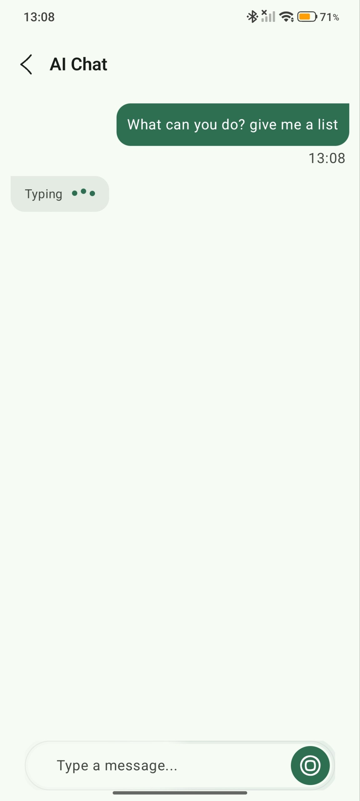
  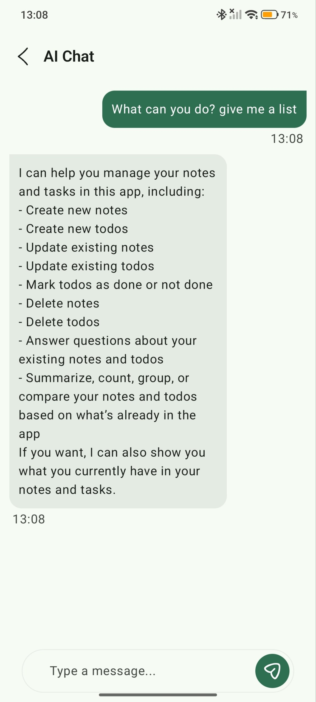
  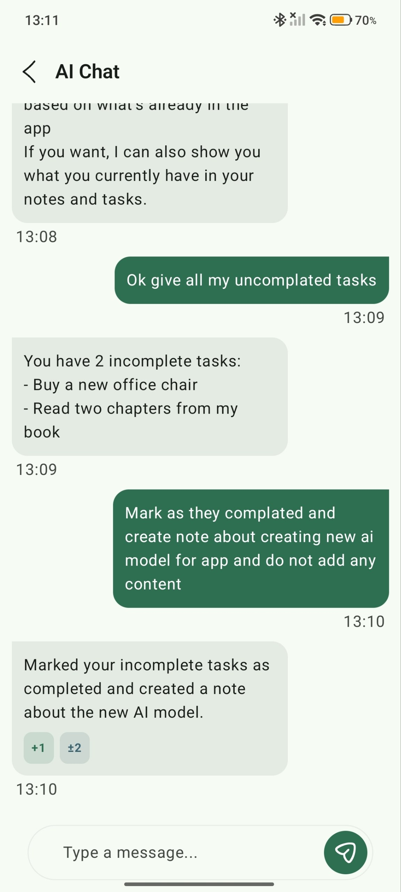
</p>
<p align="center">
  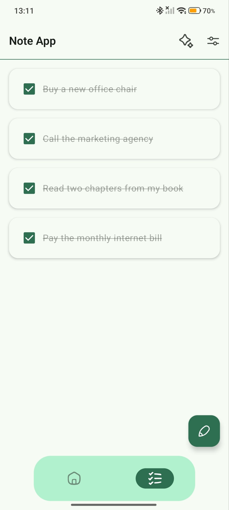
  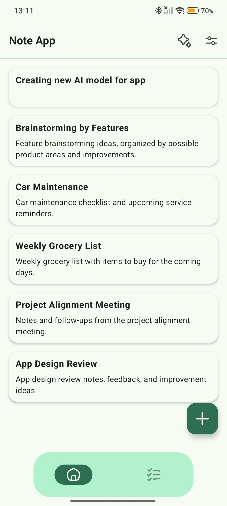
  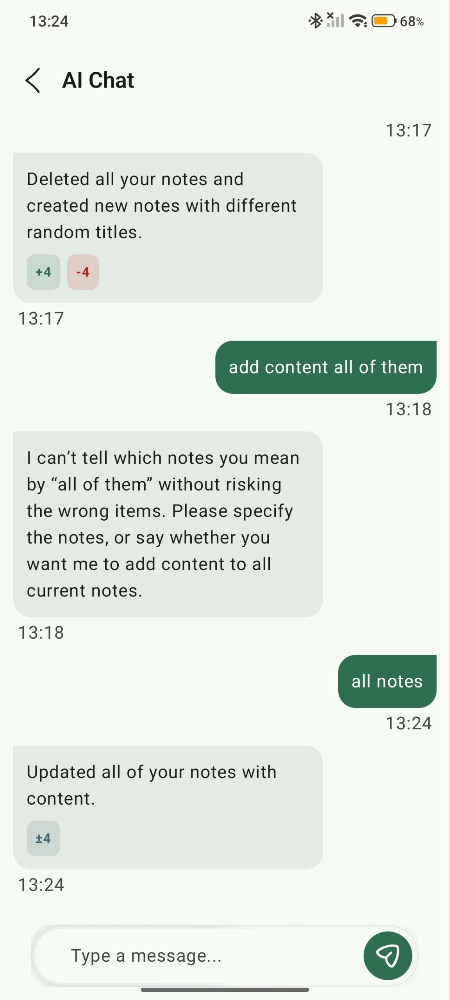
</p>
<p align="center">
  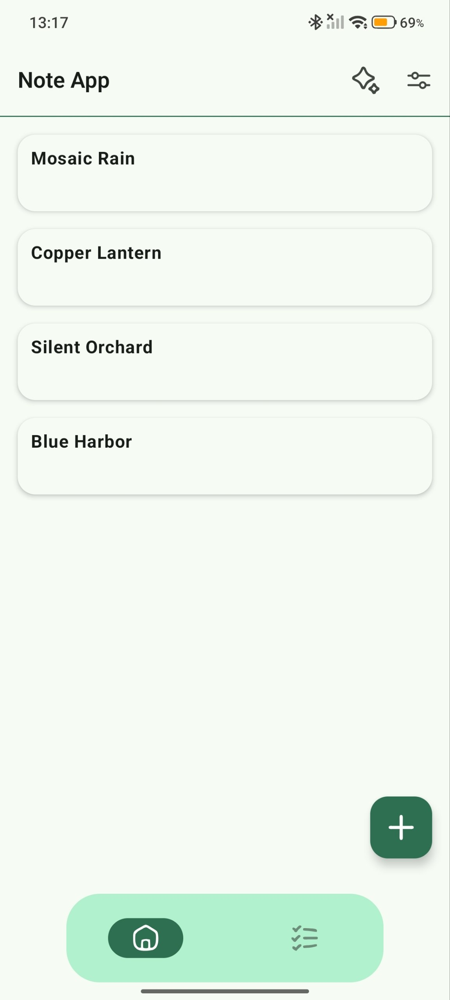
  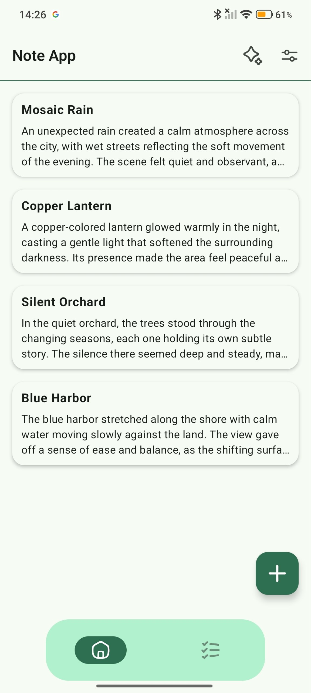
</p>

## Notes & Todos — Offline Mode

Notes and todos are offline-first: every read comes straight from Room, and every write lands in Room immediately, regardless of connectivity.

- **Local writes are optimistic.** `createNote`/`createTodo` insert a local row right away with a temporary `LOCAL_...` id (`addLocalBanner()` / `isLocal()`) and `isSynced = false`, then try the remote call. If the remote call fails (no connection), the local row simply stays as an unsynced draft — the user sees it immediately either way.
- **Deletes work the same way.** If a delete can't reach the server, the row is kept but flagged `isDeleted = true, isSynced = false` instead of being removed, so it can be deleted remotely later.
- **`AppNetworkManager`** wraps `ConnectivityManager.NetworkCallback` into a single `isConnected: StateFlow<Boolean>`.
- **`NotesViewModel`/`TodoViewModel`** collect `isConnected`, and every time it flips to `true`, they call `syncNotes()`/`syncTodos()` in the background — no manual "sync" button needed.
- **What sync actually does**, per repository:
  1. Push locally-deleted items first: if the id `isLocal()` (never reached the server), just drop it locally; otherwise call the remote delete, then drop it locally.
  2. Push every remaining unsynced item (`isSynced == false`): local-id items get created remotely and re-inserted with the server's real id; existing items get updated remotely.
  3. Pull the full remote list and reconcile it into Room (`isSynced = true`), keeping each item's original local `createdAt` so ordering doesn't jump around after a sync.
- All of this happens quietly in the background thread the ViewModel's `viewModelScope` runs on — the UI just keeps reading from the same local Room `Flow` throughout.

First row is light theme, second row is dark theme:

| Login | Register | Notes | Todo | Note Detail | Settings | Language |
|---|---|---|---|---|---|---|
| 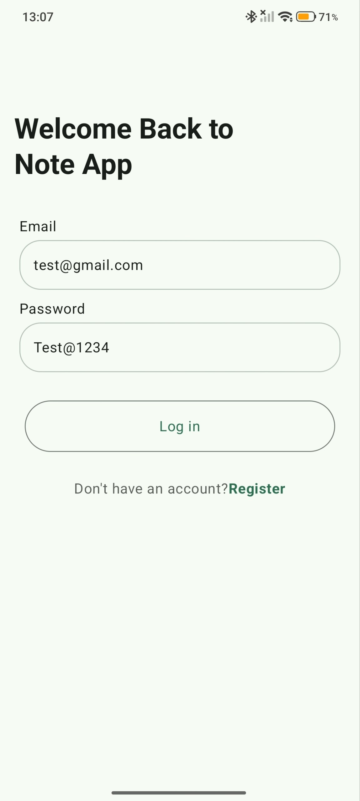 | 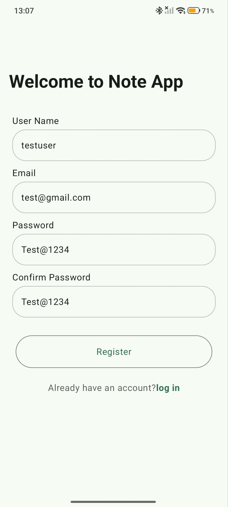 | 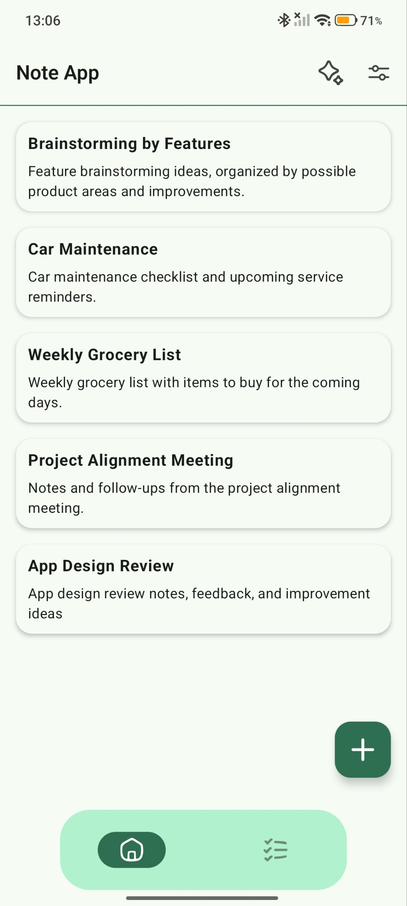 | 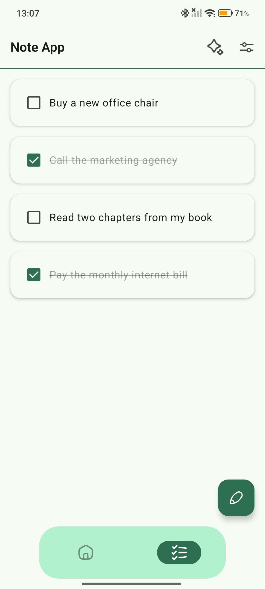 | 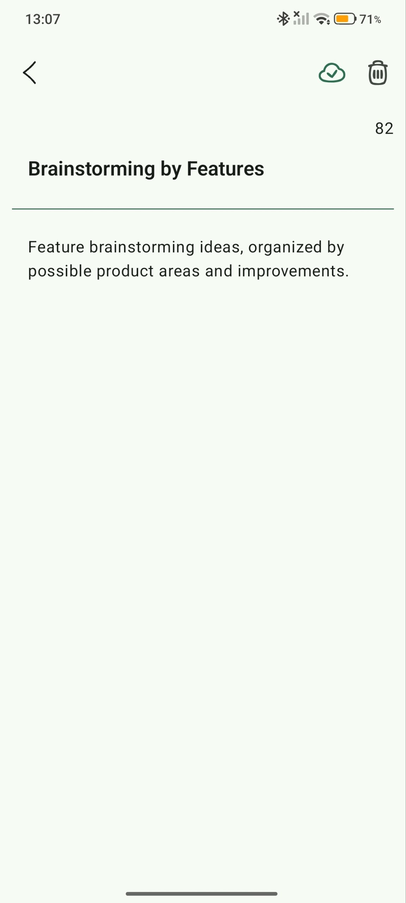 | 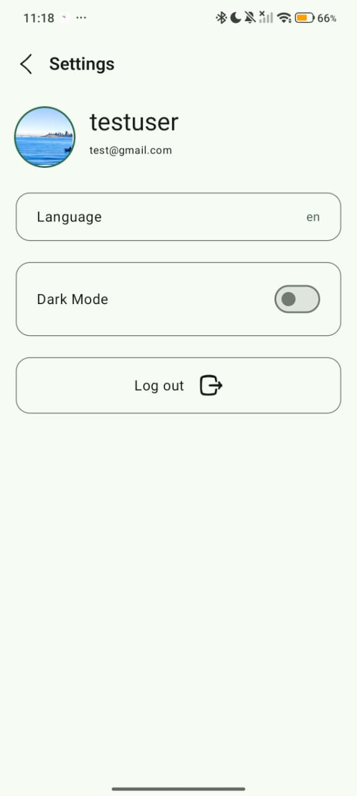 | 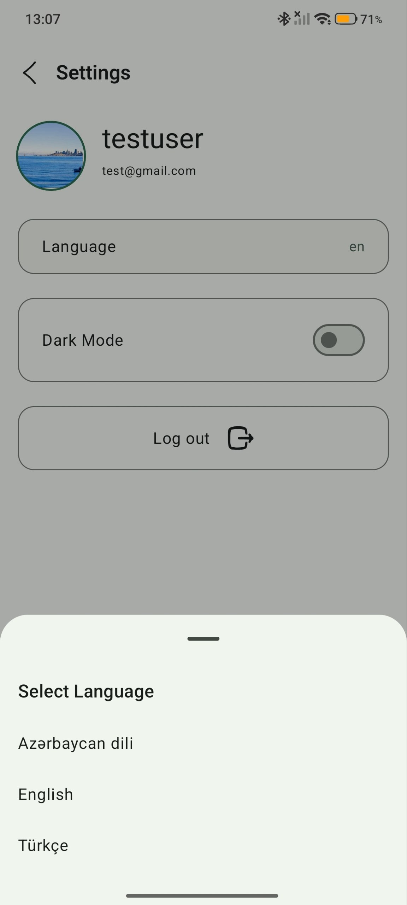 |
|  | 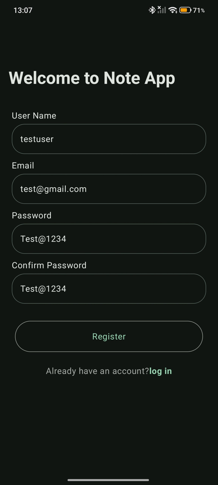 | 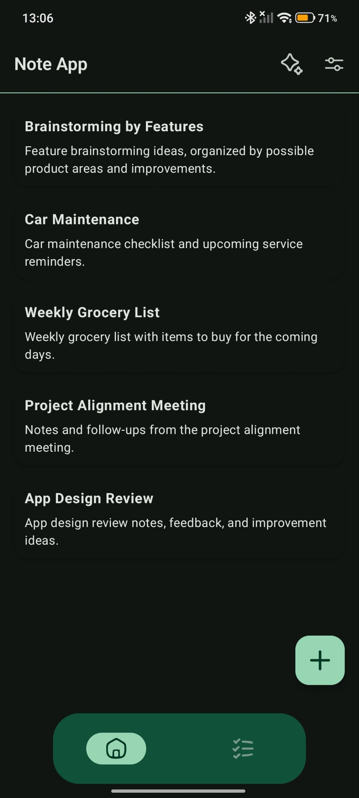 | 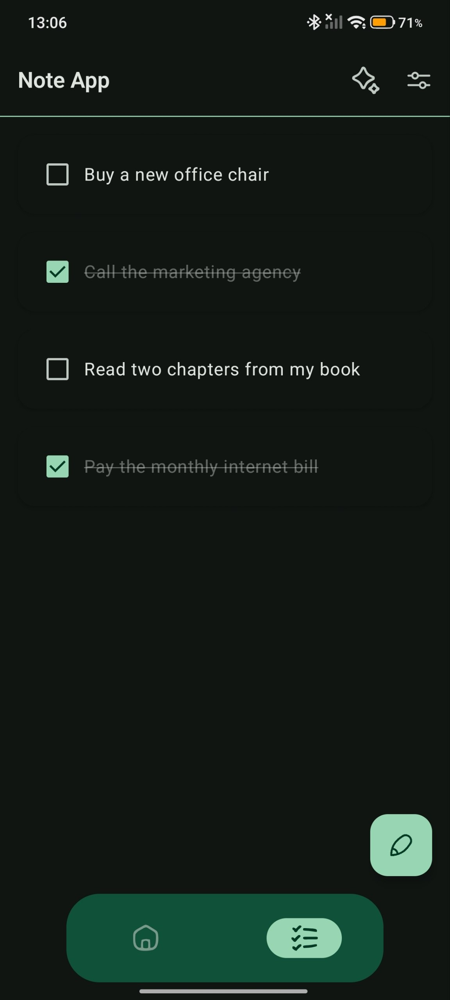 |  | 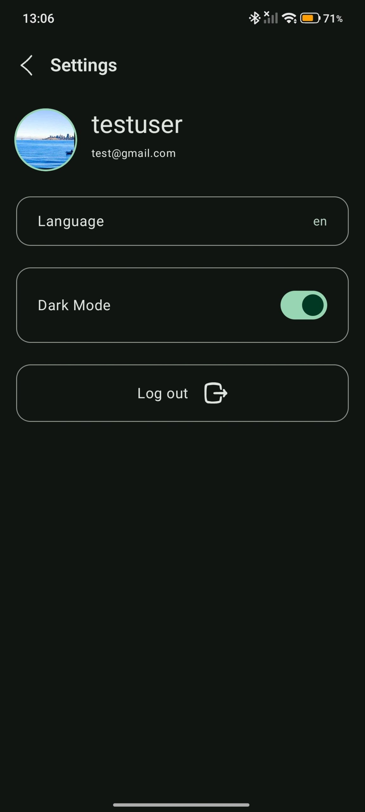 | 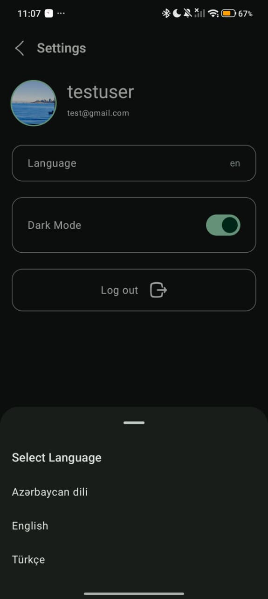 |

## Setup

1. Clone the repository:
```bash
git clone https://github.com/MegrurNiftiyev/kotllin-note-app
```

2. Open the project in Android Studio.

3. Add your OpenAI API key to your (git-ignored) root `local.properties`:
```properties
OPENAI_API_KEY="sk-proj-xxxxxxxxxxxxxxxxxxxxxxxxxxxxxxxxxxx"
```
and expose it as a `buildConfigField` in `app/build.gradle` (so `BuildConfig.OPENAI_API_KEY` resolves) — without it the project builds, but `OpenAiInterceptor` won't be able to authenticate AI requests.

4. Point the app to your backend instance in `core/constants/ApiUrls.kt` if you're not using the hosted default.

5. Sync Gradle and run on an emulator or device.

## Backend

This app is the client counterpart to the [note-app-backend](https://github.com/MegrurNiftiyev/note-app-backend) REST API (Node.js, Express, MongoDB). See that repository for endpoint documentation, auth token delivery details, and setup instructions.

## License

Licensed under the MIT License.
